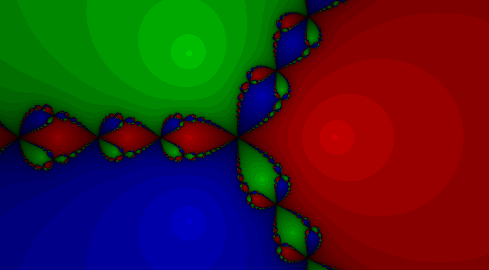
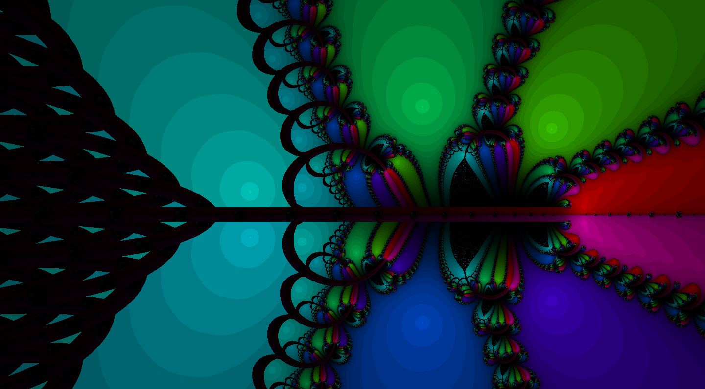
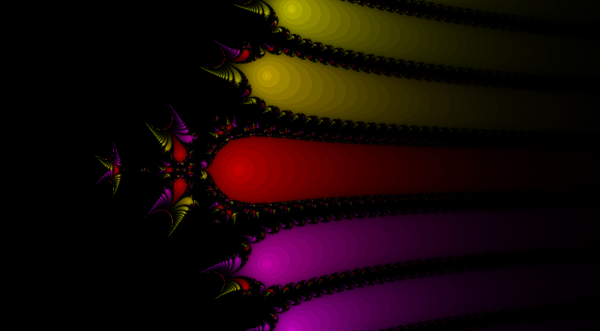
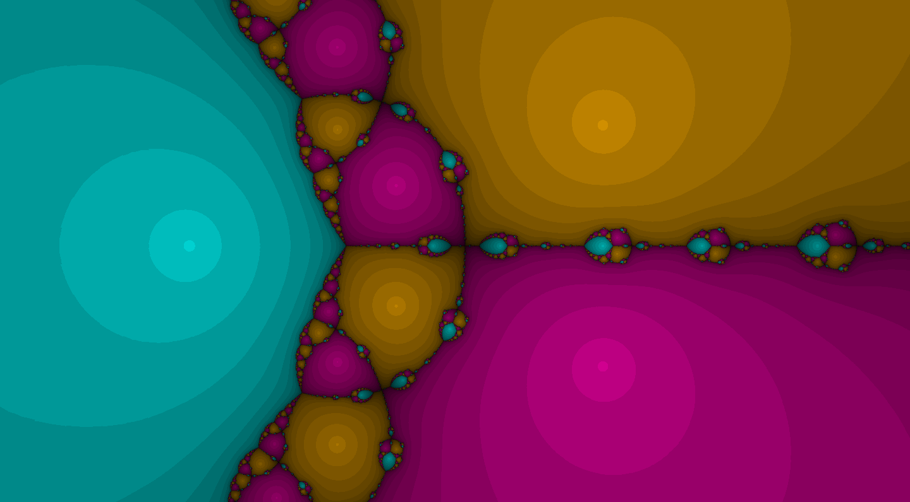

## Newton Fractals

Interactive Newton fractals renderer using WebGL 2 and adaptive decimal arithmetic.

[Click to try](https://nathsou.github.io/fractals/)

Features :

- Pan and zoom freely (both on desktop and touchscreens)
- Custom function input
- Click anywhere to draw sucessive approximations starting at the mouse position

### Deep zoom

The camera stores its center and zoom as decimal strings. Pixel spacing determines
the working precision (at least 40 significant digits plus a zoom-dependent guard
budget). The WebGL 2 renderer handles ordinary views. Before Float32 roundoff
approaches pixel spacing, polynomial Newton views (degree 1–8) switch to GPU
perturbation: a worker computes a decimal reference orbit and Taylor coefficients,
and the shader iterates each pixel's displacement using a cancellation-resistant
formula. Complex mantissas and binary exponents are stored separately, including
for reference values, so tiny offsets and huge excursions near poles do not
underflow/overflow ordinary floats. This is extended-range floating-point GPU
arithmetic around a high-precision reference, not arbitrary-precision GLSL.

A bounded 64×64 GPU preview covers the view first. Native-resolution 128×128
tiles follow, yielding between draws so navigation can cancel the work. An error
estimate and cancellation checks reject uncertain pixels. Up to two subdivision
levels provide closer reference orbits; remaining pixels alone are recomputed
with adaptive decimal arithmetic. Gray preview areas are awaiting recovery, not
assumed basin membership. This numerical error estimate is not a rigorous interval
bound. GPU rendering has finite mantissa precision; difficult boundaries can still
require substantial recovery time.

Other methods and non-polynomial expressions use the general decimal worker.
Function values and first/second derivatives are evaluated together using automatic
differentiation, retaining literal digits and supporting the same expression syntax.
Integer powers use multiplication rather than polar logarithms.

General-backend deep views start with at most 16×16 samples covering the entire viewport, then
halve the sampling block size each pass down to individual pixels. The previous
frame stays visible while the new preview is computed; a status label identifies
it as the previous preview until replacement tiles arrive. Each sample is
recomputed with 24 additional decimal digits and a larger iteration budget. Root
disagreement or lack of convergence triggers further retries. This is a numerical
stability check, not a mathematical proof of basin membership at a boundary.
Unresolved final pixels are gray and reported in the status line. Computation yields
between batches, and stale frames are cancelled/ignored when the view changes.
Click paths use the same decimal coordinates and iteration arithmetic.

The current resource limits are 512 significant digits, three precision retries,
and 4096 iterations per orbit. The camera stops before exceeding its precision
budget. Transcendental functions use decimal.js's arbitrary-precision routines;
inputs outside those routines' supported range produce an explicit render error.
Full-resolution deep renders can take substantial time, especially on Retina
displays or near complicated boundaries. Refinement is shown as progress; the
coarse passes are previews, and no finite-resolution image can resolve subpixel
structure. Adaptive supersampling is not implemented.

### Development and verification

Use a current Node.js version compatible with Vite 8, then run `npm ci`, `npm test`,
and `npm run build`. The numerical tests cover camera motion at 1e100 zoom, exact
literals, complex derivatives, all iteration methods, singularities, and opposite
basins separated by 1e-80 against a 200-digit reference calculation.

With `npm run dev` running, open `/tests/browser.html` for the browser integration
tests: all preset/method shader variants, deep worker rendering, texture upload,
cancellation, and complete final tile coverage. WebGL 2 is required.
`/tests/perturbation.html` compares deep GPU/recovery pixels at zooms through
1e80 with independent 200-digit Newton orbits. Unit tests also exercise reference
encoding at 1e180, including excursions beyond Float64 range.

z^3 - 1

z^log(z + i) - 1

z^z - 2

z^3 - 2 * z + 3

