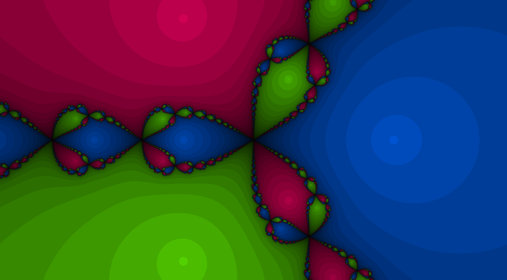

## Newton Fractals

Interactive Newton fractals rendere in WebGL

Features :

- Pan and Zoom freely
- Custom function input
- Click anywhere to draw sucessive approximations starting at the mouse position

$f(z) = z^{3} - 1$

$f(z) = z^{log(z)} + i - 1$

$f(z) = z^z - 2$
