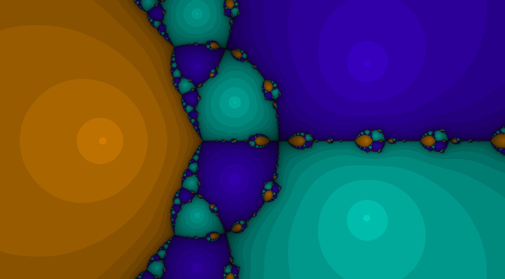

## Newton Fractals

Interactive Newton fractals renderer in WebGL

[Click to try](https://nathsou.github.io/fractals/)

Features :

- Pan and zoom freely
- Custom function input
- Click anywhere to draw sucessive approximations starting at the mouse position

z^3 - 1

z^log(z + i) - 1

z^z - 2

z^3 - 2 * z + 3
